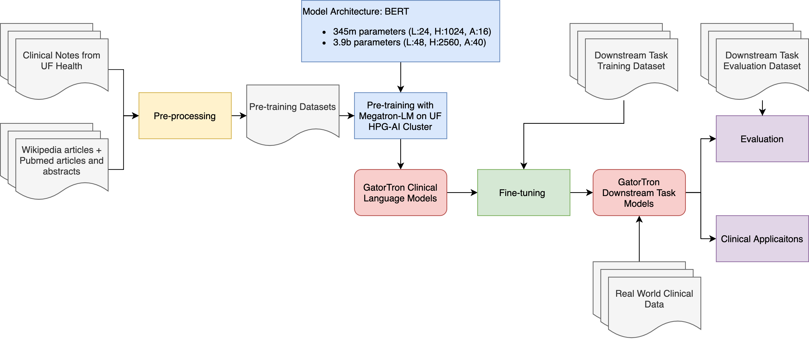

# GatorTron
all scripts used in gatortron project

## Project

Rapid adoption of electronic health record (EHR) systems have made large collections of real-world EHR data available for research. Nevertheless, much of the critical information about a patient, such as family history, drug adverse events, and social, behavioral, and environmental determinants of health, is well-documented only in narrative clinical text as opposed to structured EHR data. Clinical concept extraction through named-entity recognition (NER) is the key technology to unlock the rich patient characteristics buried in unstructured clinical text to support downstream applications that rely on structured data.  
 
Recent advancements in deep learning, especially the Transformer architectures, have emerged as the current state-of-the-art Natural Language Processing (NLP). The performance of Transformer models heavily depends on the size and data domain of the training corpus used to generate pre-trained language models. In this project, we trained the largest clinical language model to date, Gatortron. Gatortron was trained using clinical notes available from the University of Florida Health system that cover more than 1 million patients, hundreds of times larger than the largest existing pretrained transformer-based language models’ corpora. In addition to using a domain-specific vocabulary, the model was trained by leveraging Nvidia’s Megatron transformer-based language modeling framework for model-parallel (tensor and pipeline) and accelerated multi-node pre-training across a DGX SuperPOD with over 1,000 A100 GPUs.
 
An evaluation of Gatortron using a de-identification task (i.e., detect and remove 18 personal identifiers such as names and birth dates from protected health information) showed that the newly trained Gatortron language model, achieved state-of-the-art performance.

## workflow

- pretraining GatorTron LM 
- fine tuning pretrained GatorTron models on downstream clinical tasks like 2010i2b2 NER

## Pretraining
- leverage the Megatron-LM
- distributed pretrained models on 120+ nodes with 900+ GPUs
- pretrainined dataset: UF notes + pubmed + wiki (500GB+ text; 100+ billion words)
- Gatortron-base (345m parameters; L:24 H:1280 A:12; 1/4 uf notes)
- Gatortron-large (3.9b parametersl L:48 H:2560 A: 40; all corpora)

## Fine-tuning
- leverage the NeMo toolkit
- 2010i2b2
- 2012i2b2
- UF de-identification